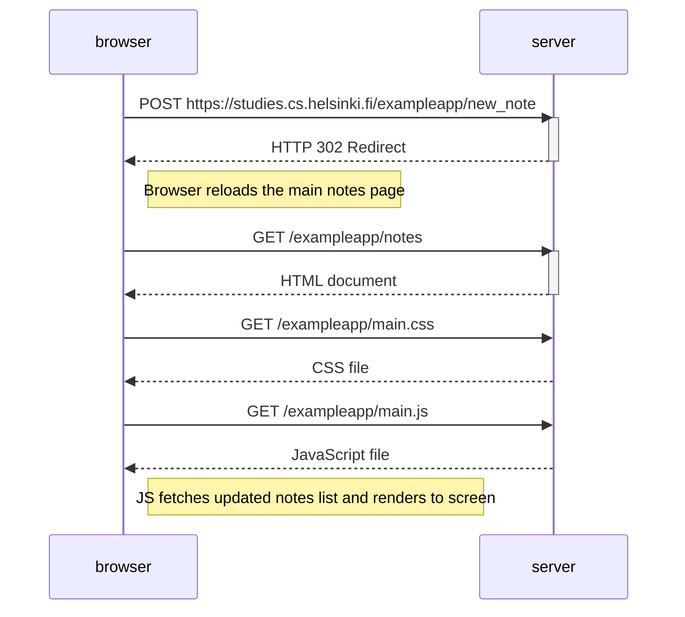

```mermaid
sequenceDiagram
    participant browser
    participant server

    browser->>server: POST https://studies.cs.helsinki.fi/exampleapp/new_note
    activate server
    server-->>browser: HTTP 302 Redirect
    deactivate server

    Note right of browser: Browser reloads the main notes page

    browser->>server: GET /exampleapp/notes
    activate server
    server-->>browser: HTML document
    deactivate server

    browser->>server: GET /exampleapp/main.css
    server-->>browser: CSS file

    browser->>server: GET /exampleapp/main.js
    server-->>browser: JavaScript file

    Note right of browser: JS fetches updated notes list and renders to screen
```
