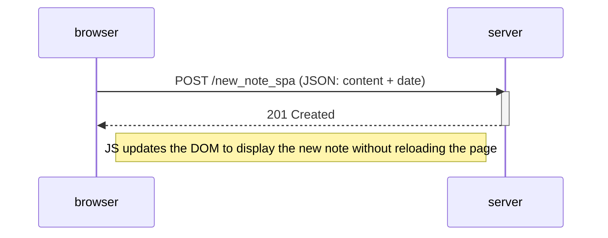

```mermaid
sequenceDiagram
    participant browser
    participant server

    browser->>server: POST /new_note_spa (JSON: content + date)
    activate server
    server-->>browser: 201 Created
    deactivate server

    Note right of browser: JS updates the DOM to display the new note without reloading the page
```
