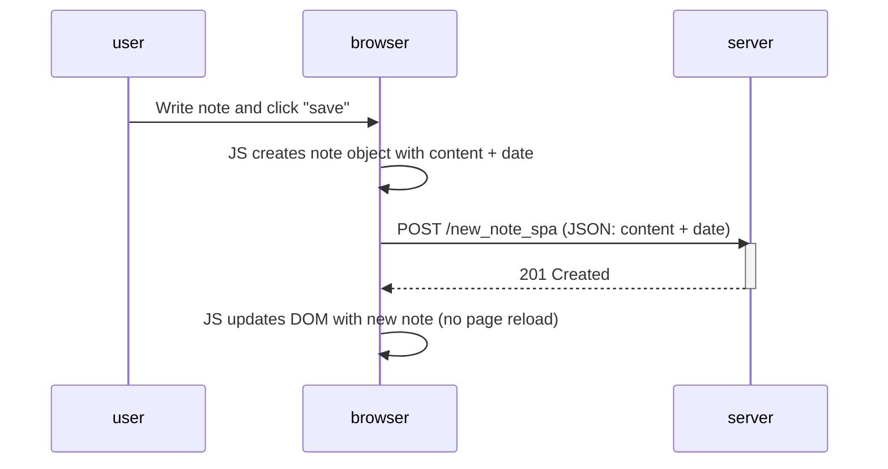

```mermaid
sequenceDiagram
    participant user
    participant browser
    participant server

    user->>browser: Write note and click "save"
    browser->>browser: JS creates note object with content + date
    browser->>server: POST /new_note_spa (JSON: content + date)
    activate server
    server-->>browser: 201 Created
    deactivate server
    browser->>browser: JS updates DOM with new note (no page reload)
```
